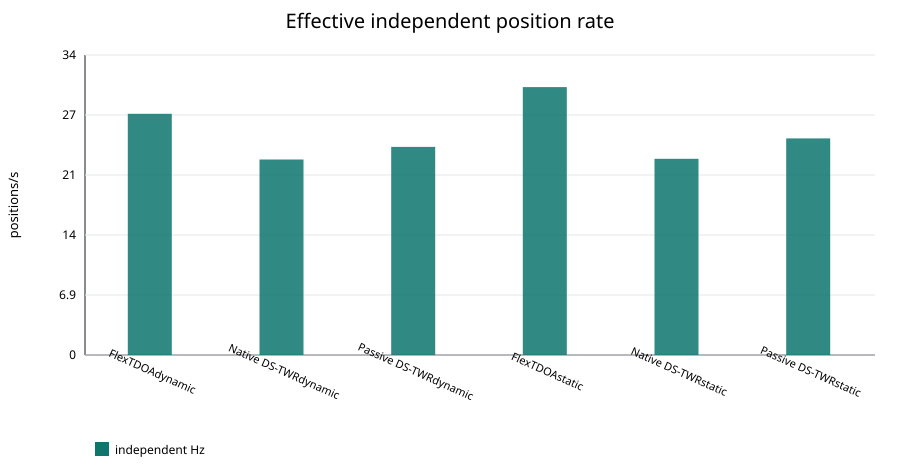
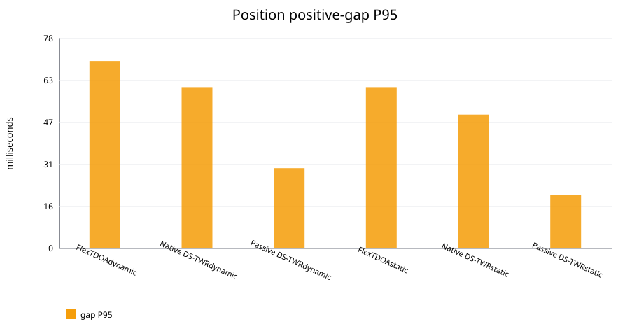
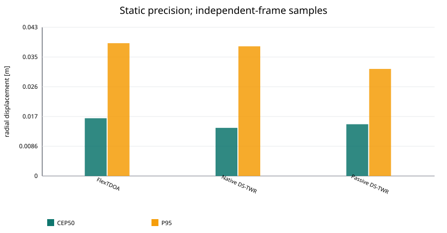
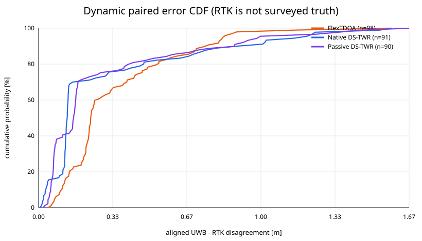
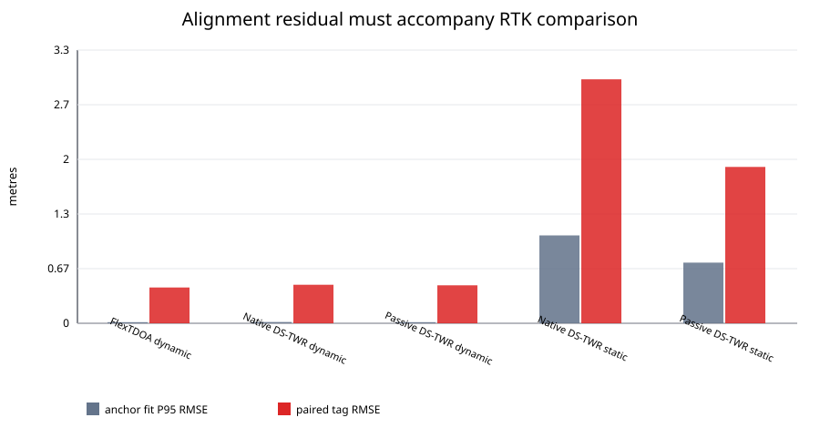

# Dynamic/static UWB comparison

Generated from immutable JSONL captures. This report compares published
position streams; it does not modify or invoke replay/dashboard code.

> **Interpretation warning:** RTK is an in-system reference, not independently
> surveyed ground truth. UWB coordinates are rigidly registered to robust
> medians of RTK-fixed anchor positions. The anchor-registration residual,
> GNSS fixed availability, sparse time association, antenna lever arms and any
> RTK-derived dynamic geometry limit every absolute-error statement below.

## Capture matrix

| capture | protocol | motion | duration s | position n | capture Hz | active Hz | independent Hz | coverage % | gap P95 ms | gap max ms |
|---|---|---|---|---|---|---|---|---|---|---|
| flextdoa_walk_imu_clean | FlexTDOA | dynamic | 150.2 | 4149 | 27.62 | 27.64 | 27.62 | 99.9 | 70.0 | 2030.0 |
| native_ds_walk_imu_clean_take2 | Native DS-TWR | dynamic | 150.1 | 3359 | 22.38 | 22.39 | 22.38 | 99.9 | 60.0 | 410.0 |
| passive_ds_walk_imu_clean | Passive DS-TWR | dynamic | 150.0 | 10702 | 71.33 | 71.37 | 23.84 | 99.9 | 30.0 | 610.0 |
| flextdoa_static_final | FlexTDOA | static | 30.3 | 929 | 30.67 | 30.82 | 30.67 | 99.4 | 60.0 | 140.0 |
| native_ds_static_final | Native DS-TWR | static | 30.5 | 686 | 22.47 | 22.56 | 22.47 | 99.4 | 50.0 | 70.0 |
| passive_ds_static_final | Passive DS-TWR | static | 31.1 | 2295 | 73.72 | 74.36 | 24.80 | 99.1 | 20.0 | 190.0 |

Missing cells:

- None.

Passive DS publishes overlapping raw windows. Comparative position metrics use
only records marked `independent_frame`; the all-event rate remains visible as
an operational telemetry rate. Dashboard fusion records (`imu_fused=true` or
an `*_imu_fused_position` stream) are excluded from every raw/independent
capture metric and counted separately in `capture_metrics.csv`. `Capture Hz`
uses the full capture wall duration; `active Hz` uses the stream's own uptime
span. Coverage and end-lag fields expose captures whose telemetry stops early.

## Static precision

Static precision is radial displacement around each capture's own local-frame
median. It is **precision, not absolute accuracy**, and uses independent-frame
samples without deleting outliers.

| protocol | n | CEP50 m | RMS m | P95 m | 2DRMS m | first-last drift m |
|---|---|---|---|---|---|---|
| FlexTDOA | 929 | 0.017 | 0.021 | 0.039 | 0.043 | 0.002 |
| Native DS-TWR | 686 | 0.014 | 0.020 | 0.038 | 0.040 | 0.002 |
| Passive DS-TWR | 772 | 0.015 | 0.018 | 0.031 | 0.036 | 0.004 |

## Static RTK cross-capture consistency gate

The tag was stationary, so its RTK center must agree between protocol blocks
before RTK can support an absolute ranking. The observed maximum pairwise
center separation is **2.032
m**, against a 0.250 m gate. Verdict:
**static absolute UWB-RTK errors are audit-only and invalid for cross-protocol ranking**.

This gate is independent of the per-capture anchor fit. A small anchor-fit RMS
can coexist with a shifted tag reference and cannot rescue static ranking.

## Replay continuity and fusion

The six replay summaries are loaded from the dedicated dynamic/static replay
directories. Position/IMU rates, gaps, accepted/outlier counts and reset counts
are direct event-stream diagnostics and are the most reliable comparison in
this campaign. Replay RTK RMSE is shown separately and remains indicative: its
many matched output samples do not create more independent RTK fixes, and an
anchor-fit RMS above 0.5 m is flagged as a large alignment uncertainty.

| protocol | motion | pos Hz | gap P95 ms | gap max ms | accepted % | resets | raw RTK RMSE m | fused RTK RMSE m | anchor fit RMS m | RTK grade |
|---|---|---|---|---|---|---|---|---|---|---|
| FlexTDOA | dynamic | 27.64 | 70.0 | 2030.0 | 99.8 | 0 | 0.435 | 0.435 | 0.009 | indicative_in_system_reference |
| Native DS-TWR | dynamic | 22.39 | 60.0 | 410.0 | 96.4 | 0 | 0.478 | 0.478 | 0.020 | indicative_in_system_reference |
| Passive DS-TWR | dynamic | 23.84 | 120.0 | 610.0 | 97.7 | 0 | 0.440 | 0.440 | 0.002 | indicative_in_system_reference |
| FlexTDOA | static | 30.82 | 60.0 | 140.0 | 100.0 | 0 | n/a | n/a | n/a | audit_only_invalid_for_cross_protocol_ranking |
| Native DS-TWR | static | 22.56 | 50.0 | 70.0 | 99.7 | 0 | 2.972 | 2.974 | 1.064 | audit_only_invalid_for_cross_protocol_ranking |
| Passive DS-TWR | static | 25.01 | 105.0 | 200.0 | 100.0 | 0 | 2.369 | 2.369 | 0.715 | audit_only_invalid_for_cross_protocol_ranking |

## UWB versus RTK disagreement

Only RTK-fixed tag solutions are used. Each solution is matched to the nearest
independent UWB position by `estimated_measurement_wall_ns` versus the UWB
`received_at` timestamp, with an absolute limit of 100 ms.
The local UWB frame is mapped to RTK ENU with rotation and translation only;
scale is never fitted. `Debiased RMSE` removes the median tag residual after
anchor registration and is a shape/repeatability diagnostic, not accuracy.

| protocol | motion | pairs | time P95 ms | RMSE m | P95 m | debiased RMSE m | anchor-fit P95 RMSE m | alignment flag | RTK interpretation |
|---|---|---|---|---|---|---|---|---|---|
| FlexTDOA | dynamic | 98 | 36.1 | 0.437 | 0.830 | 0.445 | 0.013 | usable with limits | indicative_in_system_reference |
| Native DS-TWR | dynamic | 91 | 28.4 | 0.471 | 1.180 | 0.464 | 0.015 | usable with limits | indicative_in_system_reference |
| Passive DS-TWR | dynamic | 90 | 47.7 | 0.464 | 0.992 | 0.455 | 0.013 | usable with limits | indicative_in_system_reference |
| FlexTDOA | static | 0 | n/a | n/a | n/a | n/a | n/a | unavailable | audit_only_invalid_for_cross_protocol_ranking |
| Native DS-TWR | static | 129 | 23.0 | 2.979 | 3.002 | 0.025 | 1.073 | poor / no accuracy claim | audit_only_invalid_for_cross_protocol_ranking |
| Passive DS-TWR | static | 244 | 42.9 | 1.909 | 1.933 | 0.020 | 0.741 | poor / no accuracy claim | audit_only_invalid_for_cross_protocol_ranking |

## Method and limitations

- GPS coordinates are converted from WGS84 ECEF to a common local ENU frame.
- Interleaved dashboard fusion positions are excluded before all raw position
  metrics; raw events may still carry `imu_fused_*` diagnostic fields.
- Anchor centers are per-capture component-wise medians of RTK-fixed samples.
- A 2-D proper rigid transform is fitted from the local anchor geometry to the
  RTK centers. At least three fixed anchors are required.
- Time-varying Passive DS geometries use the nearest captured geometry
  snapshot, preferring an exact `geometry_version`. A non-exact dynamic
  geometry older than 10.0 s is rejected.
- A Passive DS geometry marked dynamic is itself derived from GNSS. Its frame
  alignment is therefore not independent of the RTK reference; the report
  marks this circularity explicitly.
- RTK `fixed` status does not guarantee centimetre-level truth. Anchor P95
  spread and rigid-fit residual are exported, and poor cases are flagged.
- `estimated_measurement_wall_ns` subtracts the receiver-reported fix age from
  collector wall time. It is not hardware timestamp synchronization. Pair
  count, coverage and association error must accompany RMSE/P95.
- The tag and anchor GNSS antennas need not be collocated with their UWB
  antennas; unknown lever arms appear as bias.
- Static and dynamic blocks are not repeated randomized trials. Differences
  may include path, orientation, RF environment and geometry-state changes.
- Capture-boundary samples outside the common RTK/UWB interval are not paired.

## Audit artifacts

- `analysis_summary.json`: nested machine-readable results and policies;
- `capture_metrics.csv`: one flattened row per capture;
- `rtk_alignment_metrics.csv`: registration and RTK-pair metrics;
- `rtk_pairs.csv`: every accepted time association and residual;
- `alignment_snapshots.csv`: every geometry-to-RTK rigid fit;
- `replay_metrics.csv`: continuity, fusion and replay RTK diagnostics;
- `../raw/imu_fusion_validation_20260811/data/*.jsonl.xz`: the six complete RAW captures, compressed losslessly;
- `raw_data_manifest.csv` and `SHA256SUMS`: source/archive integrity and round-trip verification.
- `figures/`: dependency-free SVG plots.

## Reproduce

The original scratch paths are recorded in `analysis_summary.json`. Those RAW
files were replaced by the lossless archives in
`../raw/imu_fusion_validation_20260811/data/`; decompress them to a
scratch input directory before rerunning the report pipeline. Verify the
archives with `SHA256SUMS` and use `raw_data_manifest.csv` to confirm the
original byte counts and SHA-256 digests after decompression.
