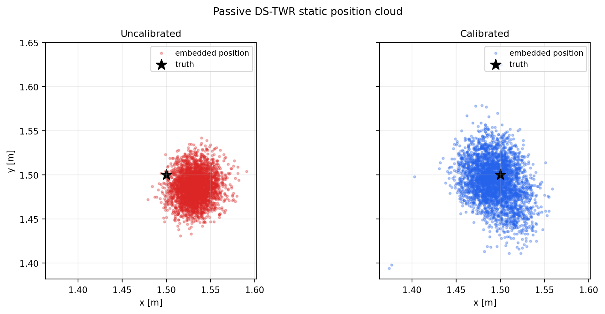
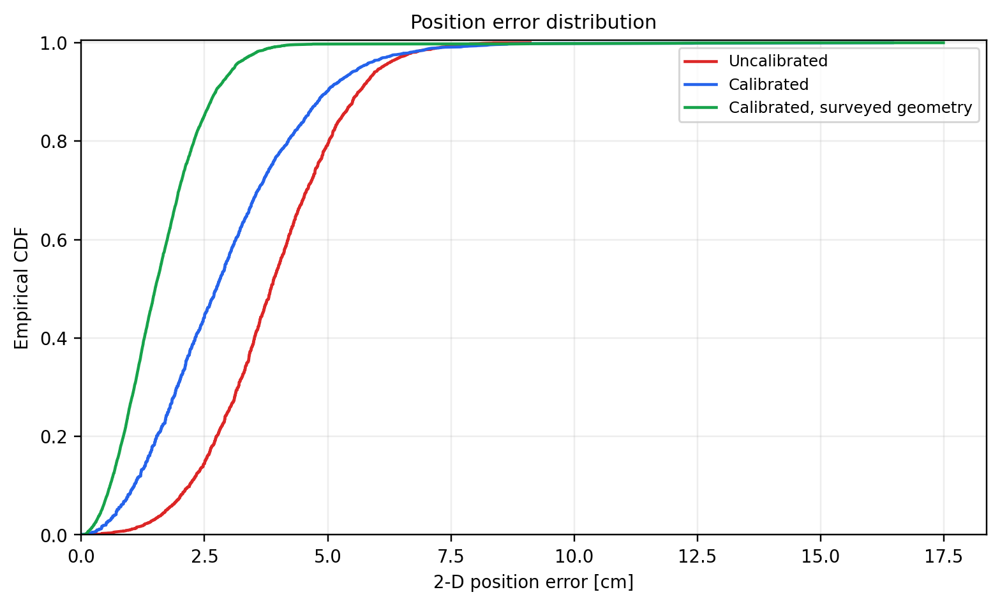
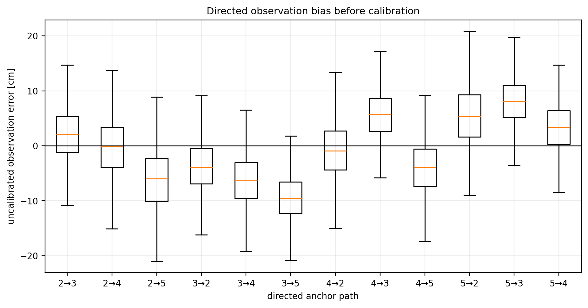
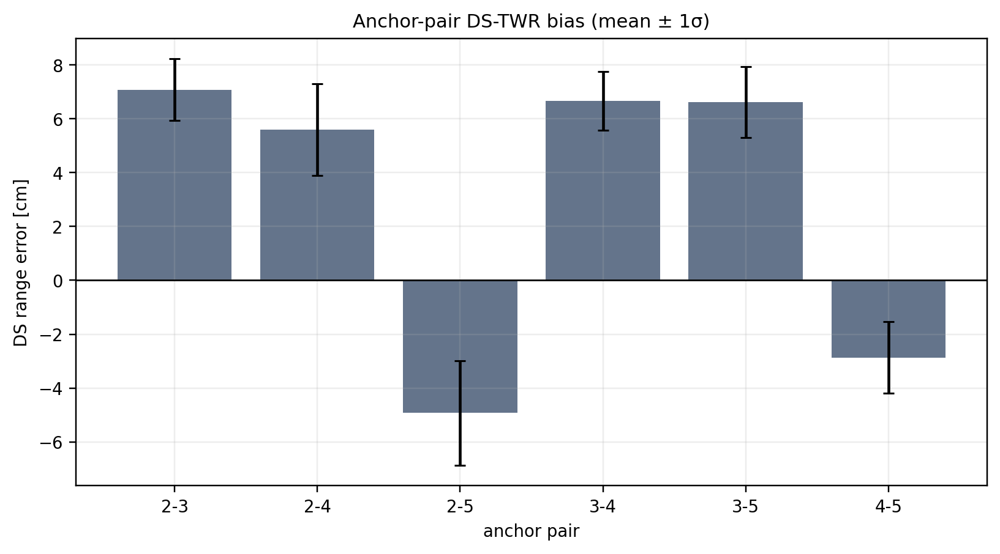

# Passive DS-TWR known-geometry calibration

Static LOS validation of the receive-only Passive DS-TWR tag. Four anchors
formed a surveyed 3.000 m square and the tag was placed at its center:

```text
A2 = (0.000, 0.000) m    A3 = (0.000, 3.000) m
A4 = (3.000, 0.000) m    A5 = (3.000, 3.000) m
Tag 1 = (1.500, 1.500) m
```

The placement tolerance was approximately ±2 mm. Both captures used Robust
Rotating, 5 ms slots, a 1 ms frame gap, 1000 us RESP and FINAL delays, and UWB
channel 5. Each capture lasted 120 s.

## Result

| Processing path | Positions | Rate | Bias X/Y | Mean error | 2-D RMSE | P95 |
|---|---:|---:|---:|---:|---:|---:|
| Uncalibrated, embedded autonomous geometry | 3,362 | 28.00 captured/s | +3.24 / -1.35 cm | 3.89 cm | 4.12 cm | 6.09 cm |
| Calibrated, embedded autonomous geometry | 3,512 | 29.26 captured/s | -0.66 / -0.70 cm | 2.92 cm | 3.33 cm | 5.66 cm |
| Calibrated, surveyed geometry offline | 5,901 | 49.17 frames/s | -0.30 / -0.27 cm | 1.62 cm | **1.89 cm** | **3.11 cm** |

Calibration reduced the live embedded RMSE by **19.2%** and reduced the
position-bias magnitude from **3.51 cm to 0.96 cm**. The HTTP collector stores
only the newest embedded position in each snapshot, so its 28-29 positions/s
is an observation limit, not the radio/solver limit. Reconstructing one
solution per complete three-slot star gives 49.2-49.3 frames/s.

The calibrated embedded result contains five estimates above 10 cm (0.142%),
including two above 15 cm. These are short transients rather than a shifted
distribution. They remain visible in every metric and plot.





## Calibration model

The first half of the uncalibrated observation capture was used to fit the
scalable per-anchor model:

```text
error(I -> R) = bias(R) - bias(I)

A2 =   0 mm
A3 = +34 mm
A4 = -16 mm
A5 = -55 mm
```

Only `N - 1` independent values are needed for `N` anchors because A2 fixes
the arbitrary common offset. This model reproduces all 12 directed-path
corrections without storing a separate value for every direction.

The mean DS range errors provide six unordered pair corrections:

| Pair | Bias |
|---|---:|
| A2-A3 | +71 mm |
| A2-A4 | +56 mm |
| A2-A5 | -49 mm |
| A3-A4 | +67 mm |
| A3-A5 | +66 mm |
| A4-A5 | -29 mm |





The uncorrected pair distances fit a planar geometry with 1.99 cm range
residual RMS, but displace the reconstructed anchors by several centimeters.
This explains the remaining difference between the calibrated embedded result
(autonomous geometry, 3.33 cm RMSE) and the same calibrated observations solved
with the surveyed geometry (1.89 cm RMSE).

## Interpretation

This experiment validates the four immediate implementation items:

1. use the responder CFO to correct the reply interval in tag clock units;
2. preserve and expose each directed observation and piggybacked DS range;
3. correct directed observations with a compact per-anchor bias model;
4. correct the DS ranges used by the autonomous geometry solver per anchor
   pair.

The correction is operationally applied to passive tags only. Ranging anchors
continue to execute the three-frame exchange without needing these position
calibration values.

The main remaining limitation is now the autonomous geometry input, not the
receive-only TDOA equation. The next iteration should robustly filter
anchor-pair ranges (rolling median/Huber estimator, physical-change gate, and a
slower geometry update cadence), then repeat this test at multiple static tag
locations and along a dynamic trajectory. One center point is sufficient to
identify the current bias, but not to claim workspace-wide accuracy.

## Reproduce

```bash
cd /home/pi/Documents/UWB
python3 tools/uwb_passive_ds_known_geometry_analyze.py
```

The ready-to-read report is
`Passive_DS-TWR_known_geometry_report_2026-07-27.pdf`. The analyzer reads
either the committed `*.jsonl.xz` files or decompressed `*.jsonl` files and
regenerates its supporting outputs:

- `analysis_summary.json`
- `position_metrics.csv`
- `observation_metrics.csv`
- `anchor_range_metrics.csv`
- `protocol_metrics.csv`
- `raw_data_manifest.csv`
- `figures/*.png` and `figures/*.pdf`

Rebuild the PDF with:

```bash
cd reports/passive_ds_known_geometry_20260727
latexmk -pdf -interaction=nonstopmode -halt-on-error \
  -jobname=Passive_DS-TWR_known_geometry_report_2026-07-27 report.tex
```
