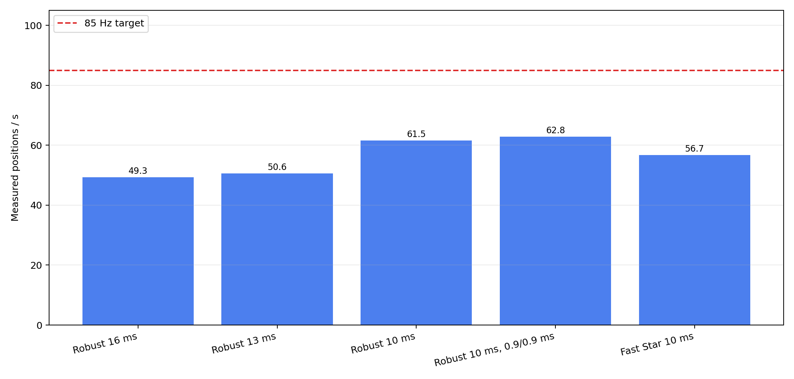
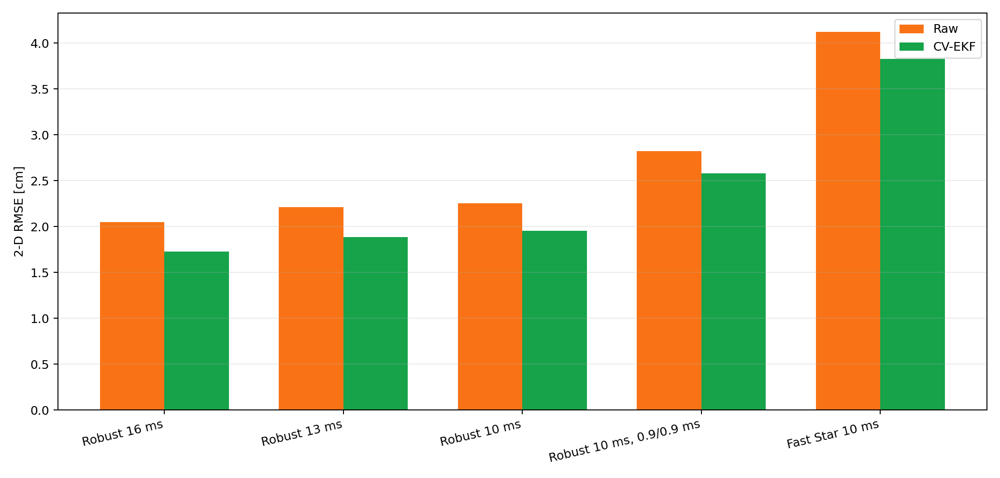
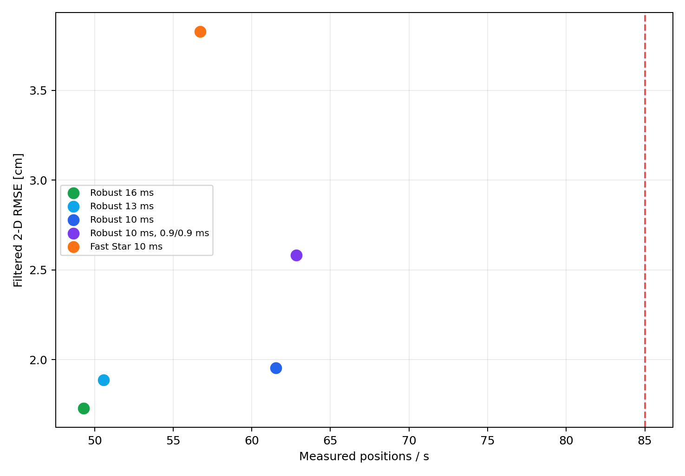

# Passive DS-TWR speed-limit study

Date: 2026-07-27

Geometry: surveyed 3 m × 3 m square (±2 mm), stationary tag at (1.5 m, 1.5 m)
Firmware: `137c2b5`

## Result

The best fast operating point is **Robust Rotating, configured 10 ms frame, 1.0/1.0 ms RESP/FINAL delays**. It delivered **61.5 positions/s**, **1.95 cm 2-D RMSE**, and **3.23 cm P95**.

The most accurate point was Robust 16 ms: 49.3 positions/s and 1.73 cm RMSE. The 10 ms setting therefore adds useful speed for only a small accuracy cost.

Fast Star did not improve speed in this geometry. It reached only 56.7 positions/s and 3.83 cm RMSE. Its asymmetric initiator load and the observed failures make Robust Rotating the better basis for further optimization.

Reducing both reply delays to 0.9 ms was rejected: rate changed from 61.5 to 62.8 positions/s, while RMSE worsened from 1.95 to 2.58 cm and P95 from 3.23 to 4.14 cm. The live setup was restored to 1.0/1.0 ms.

## Controlled measurements

| Profile | position/s | nominal/s | filtered RMSE cm | filtered P95 cm | raw RMSE cm | anchor success |
|---|---:|---:|---:|---:|---:|---:|
| Robust 16 ms | 49.3 | 62.5 | 1.73 | 2.90 | 2.05 | 98.2% |
| Robust 13 ms | 50.6 | 76.9 | 1.89 | 3.19 | 2.21 | 93.8% |
| Robust 10 ms | 61.5 | 100.0 | 1.95 | 3.23 | 2.25 | 92.1% |
| Robust 10 ms, 0.9/0.9 ms | 62.8 | 100.0 | 2.58 | 4.14 | 2.82 | 91.1% |
| Fast Star 10 ms | 56.7 | 100.0 | 3.83 | 6.15 | 4.12 | 92.9% |







## Why the result is below 85 positions/s

The 10 ms profile nominally permits 100 frames/s, but measured only 61.5. Anchor logs show about 196.7 slots/s (5.08 ms effective slot) rather than the 300 slots/s implied by the nominal 10 ms frame. Because one independent position frame needs three directed anchor dialogues, 85 positions/s needs at least 255 successful slots/s, before rejection margin.

The remaining gap is approximately 38.2% in accepted position throughput. The limiting layer is the radio transaction/scheduling path, not the dashboard or EKF. Publishing a new solution after every observation could display more than 85 updates/s, but adjacent solutions would reuse almost all of the same measurements; this report does not count that as 85 independent updates/s.

## Recommended next engineering step

1. Add per-stage timestamps and failure counters for POLL TX, RESP delayed TX, FINAL TX/RX, CIA readout, and RX re-arm.
2. Replace millisecond receive-loop scheduling with DW3000 delayed-TX/delayed-RX deadlines and a non-blocking slot state machine.
3. Keep Robust Rotating and 1.0/1.0 ms as the control profile; change one timing stage at a time and accept a variant only if RMSE and P95 remain inside the control confidence band.
4. Separately evaluate a rolling solution on every new observation as a low-latency display mode, clearly reporting both solver updates/s and independent frames/s.

## Reproducibility

Raw event streams, status snapshots, and timing logs are in [`data/`](data/). Recreate the tables and figures with:

```bash
python3 tools/uwb_passive_speed_analyze.py
```
